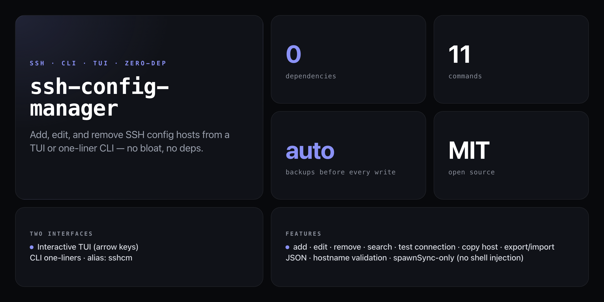

<div align="center">

**Manage your `~/.ssh/config` hosts without ever hand-editing the file again.**


</div>

---

Pick your style: launch an interactive TUI with arrow-key navigation, or drive everything from one-liners with `sshcm`. Either way, every write is backed up automatically to `~/.ssh/backups/` before the file changes.

```
 ssh-config-manager  ↑↓ navigate  Enter show  n new  e edit  d delete  t test  q quit

 ▶ prod        192.168.1.1       deploy   22    id_rsa
   staging     staging.acme.com  ubuntu   22    id_ed25519
   bastion     10.0.0.1          admin    2222  id_rsa

  3 host(s)
```

## Install

No npm account required — runs straight from GitHub:

```bash
npx github:NickCirv/ssh-config-manager [command]
```

Or install globally for the `sshcm` alias:

```bash
npm install -g github:NickCirv/ssh-config-manager
```

## Usage

```bash
# Interactive TUI (no arguments)
sshcm

# Add a host
sshcm add --host prod --hostname 192.168.1.1 --user deploy --port 22 --identity ~/.ssh/id_rsa

# List all hosts
sshcm list

# Show a specific host
sshcm show prod

# Test a connection
sshcm test prod

# Search by alias or hostname
sshcm search web

# Edit interactively
sshcm edit prod

# Remove a host (confirmation prompt)
sshcm remove prod

# Duplicate a host entry
sshcm copy prod prod-backup

# Export all hosts as JSON
sshcm export --format json > hosts.json

# Import from JSON
sshcm import hosts.json
```

## Commands

| Command | Description |
|---------|-------------|
| `sshcm` | Launch interactive TUI |
| `sshcm list` | Table of all hosts |
| `sshcm add [options]` | Add a new host entry |
| `sshcm edit <alias>` | Edit host interactively |
| `sshcm remove <alias>` | Remove with confirmation |
| `sshcm show <alias>` | Show all settings for a host |
| `sshcm search <query>` | Search by alias or hostname |
| `sshcm test <alias>` | Test SSH connection |
| `sshcm copy <src> <dest>` | Duplicate a host entry |
| `sshcm export [--format json]` | Export all hosts as JSON |
| `sshcm import <file.json>` | Import hosts from JSON |

### `add` options

| Flag | Description |
|------|-------------|
| `--host <alias>` | Short name for the host (e.g. `prod`) |
| `--hostname <ip/domain>` | IP address or domain — validated before writing |
| `--user <name>` | SSH user |
| `--port <n>` | Port (default `22`) |
| `--identity <path>` | Path to identity file |

## TUI keys

| Key | Action |
|-----|--------|
| `↑` / `k` | Move up |
| `↓` / `j` | Move down |
| `Enter` | Show host details |
| `n` | New host |
| `e` | Edit selected host |
| `d` | Delete selected host |
| `t` | Test connection |
| `q` / `Esc` | Quit / back |

## How it works

`ssh-config-manager` reads and writes `~/.ssh/config` directly using Node.js built-ins only (`fs`, `path`, `os`, `readline`, `child_process`). Key behaviours:

- **Automatic backups** — a timestamped copy is written to `~/.ssh/backups/` before every write operation.
- **Hostname validation** — IPv4, IPv6, and domain names are validated before any entry is saved.
- **Secure by construction** — connection tests use `spawnSync` only, never `exec`, eliminating shell-injection risk.
- **Formatting preserved** — the serializer writes keys in a consistent order; unrecognised SSH options are preserved as-is.
- **Export / Import** — JSON round-trip for moving hosts between machines. Identity file paths are exported as paths, never contents.

## Supported config keys

`Host`, `HostName`, `User`, `Port`, `IdentityFile`, `IdentitiesOnly`, `ForwardAgent`, `ServerAliveInterval`, `StrictHostKeyChecking`, `ProxyJump` — plus any other valid SSH key/value pairs already present in your config.

## Config location

```
~/.ssh/config     ← managed by sshcm
~/.ssh/backups/   ← automatic timestamped backups before every write
```

## What it is NOT

- **Not a secrets manager.** It stores paths to identity files, never key contents.
- **Not a full SSH client wrapper.** The `test` command probes reachability; it does not proxy or tunnel sessions.
- **Not a replacement for `~/.ssh/config` syntax.** Advanced multi-match blocks (e.g. `Host * !bastion`) are preserved on read/write but not editable through the TUI.

---

<div align="center">
<sub>Zero dependencies · Node 18+ · MIT · by <a href="https://github.com/NickCirv">NickCirv</a></sub>
</div>
